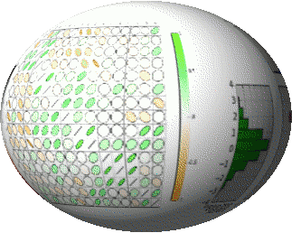

BioKit
####################

.. image:: https://badge.fury.io/py/biokit.svg
       :target: https://pypi.python.org/pypi/biokit

.. image:: https://secure.travis-ci.org/biokit/biokit.png
       :target: http://travis-ci.org/biokit/biokit

.. image:: https://coveralls.io/repos/cokelaer/biokit/badge.png?branch=master 
      :target: https://coveralls.io/r/cokelaer/biokit?branch=master 

:note: BioKit is tested with Travis for the following Python version: 2.7.9
       3.3.5, 3.4.2 and 3.5.0

:contributions: Please join https://github.com/biokit/biokit 
:issues: Please use https://github.com/biokit/biokit/issues

Overview and Installation
##############################

BioKit is a set of tools gathered from several other Python packages. 
So far, it contains a few plotting tools (viz module), some statistical
analysis, some tools to access to Taxon and GO identifier, some basic tools to
manipulate sequences and so on. It is linked to BioServices package to provide access to biological
resources. Lots of biological software are developed in R. We have also added a module to ease the installation and usage of R tools within BioKit.
 

In order to install biokit, you can use **pip**::

    pip install biokit

Releases are also available on BioConda but we would recommend pip for now,
which is more up-to-date.

Overview
#############

.. autosummary::

    biokit.network
    biokit.viz
    biokit.rtools
    biokit.services
    biokit.sequence
    biokit.stats

.. toctree::
    :maxdepth: 2 

    auto_examples/index
    references

.. _installation:

Examples in notebooks
########################

Set of `Notebooks <http://nbviewer.ipython.org/github/biokit/biokit/tree/master/notebooks/>`_

ChangeLog
############

.. toctree::
    :maxdepth: 2
    :numbered:

    ChangeLog.rst

